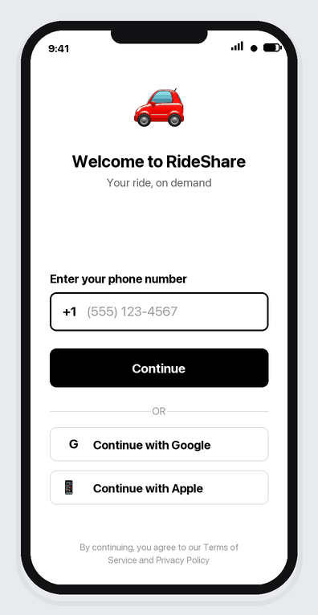

# 🚗 RideShare

A modern, cross-platform rideshare app built with React Native and Expo — phone-first onboarding, an interactive map, and a clean ride-selection flow.


[](https://github.com/alexalghisi/rideshare-app/actions/workflows/ci.yml)


<p align="center">
  
</p>

## ⬇️ Download & Install

### Android

A ready-to-install `.apk` is published with every release.

1. Open the [**latest release**](https://github.com/alexalghisi/rideshare-app/releases/latest) and download [`rideshare-app.apk`](https://github.com/alexalghisi/rideshare-app/releases/latest/download/rideshare-app.apk).
2. On your phone, allow installing apps from your browser/file manager (**Settings → Apps → Special access → Install unknown apps**).
3. Open the downloaded file and tap **Install**.

> The APK is built automatically in CI (see [`release-android.yml`](.github/workflows/release-android.yml)) — no third-party build service is involved.

### iOS

Apple does not allow a freely downloadable, install-anywhere executable: a distributable `.ipa` must be **code-signed** and delivered through **TestFlight** or the **App Store** (both require an Apple Developer account). There are two supported paths:

- **Run instantly with Expo Go** (no account needed):
  1. Install **Expo Go** from the App Store.
  2. From this project run `npm install && npm start` and scan the QR code.
- **Installable build via TestFlight** (requires an Apple Developer account):
  ```bash
  npm install -g eas-cli
  eas build --platform ios --profile preview
  ```
  Then distribute the resulting build through TestFlight.

## ✨ Features

- 🔐 **Authentication Flow** - Phone-first login with Google/Apple fallbacks
- 🗺️ **Interactive Maps** - Map with pickup/dropoff markers
- 📍 **Location Selection** - Search and select pickup/destination points
- 🚕 **Ride Options** - Multiple ride tiers (X, Comfort, XL, Lux)
- 💳 **Payment** - Payment method selection
- 🎨 **Clean UI** - Modern, consistent design language
- 📱 **Responsive Layout** - Works across screen sizes

## 📱 Screenshots

<p align="center">
  
</p>

The walkthrough steps through the core flow:
- Login screen with multiple auth options
- Home screen with recent and saved places
- Interactive map view with pickup/dropoff selection
- Ride options with pricing and vehicle details

## 🚀 Getting Started

### Prerequisites

- Node.js (v18 or higher)
- npm
- Expo CLI (`npx expo`)
- iOS Simulator (macOS) or Android Studio emulator, or a physical device with Expo Go

### Installation

```bash
npm install
```

### Run the app

```bash
npm start      # Expo dev server (press i / a / w, or scan the QR code)
npm run ios    # iOS simulator
npm run android
npm run web
```

## 🧪 Testing

The project is developed test-first with **Jest** and **React Native Testing Library**. The suite covers the pure domain logic and the behavior of every screen (navigation, gating, selection, booking).

```bash
npm test              # run the full suite
npm run test:watch    # watch mode
npm run test:coverage # coverage report
npm run lint          # ESLint
```

All specs run headlessly by mocking the native modules (maps, safe-area, gesture-handler) in [`jest.setup.js`](jest.setup.js).

## 📂 Project Structure

```
rideshare-app/
├── App.js                       # Root navigator
├── app.json                     # Expo configuration
├── eas.json                     # EAS Build profiles
├── src/
│   ├── screens/                 # Login, Home, Map, RideOptions
│   ├── data/                    # Ride catalog and saved/recent places
│   └── lib/                     # Pure helpers (e.g. phone validation)
├── __tests__/                   # Jest test suite
├── assets/                      # Icons, splash, demo
└── .github/workflows/           # CI and Android release pipelines
```

## 🛠️ Built With

- **React Native** + **Expo** - App framework and tooling
- **React Navigation** - Stack navigation
- **React Native Maps** - Map integration
- **Jest** + **React Native Testing Library** - Testing
- **ESLint** - Linting

## 🔧 Configuration

### Maps

Interactive maps require a Google Maps API key for production use.

1. Create a key in the [Google Cloud Console](https://console.cloud.google.com/) and enable the Maps SDKs for iOS and Android.
2. Set the keys in `app.json` under `ios.config.googleMapsApiKey` and `android.config.googleMaps.apiKey`.

## 📦 Building for Distribution

- **Android APK (automated):** push a version tag and the [release workflow](.github/workflows/release-android.yml) builds and attaches the APK to the GitHub Release.
  ```bash
  git tag v1.1.0 && git push origin v1.1.0
  ```
- **EAS Build (Android/iOS):** use the profiles in `eas.json`.
  ```bash
  npm install -g eas-cli
  eas build --platform android --profile preview   # internal APK
  eas build --platform ios --profile preview        # iOS (requires Apple credentials)
  ```

## 📄 License

Released under the MIT License. See [`LICENSE`](LICENSE).

---

**Happy Coding! 🚀**
